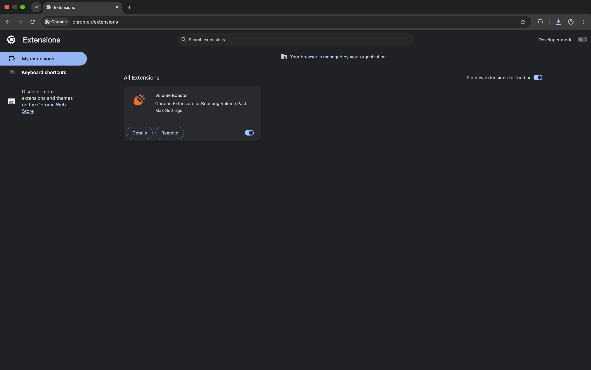
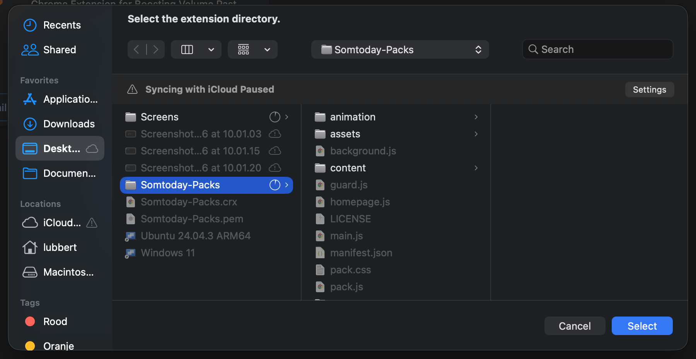
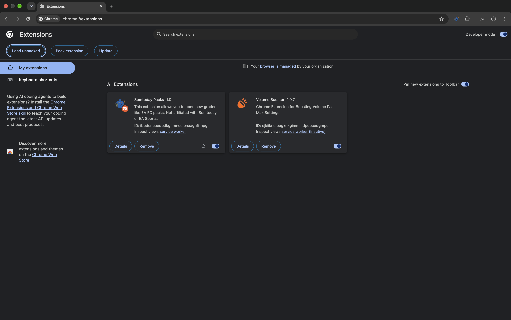
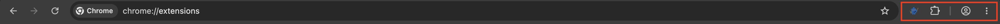
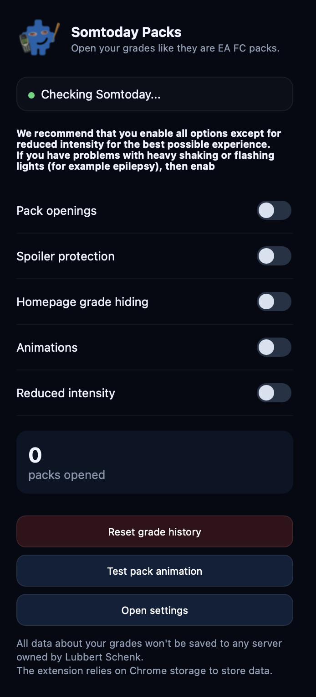
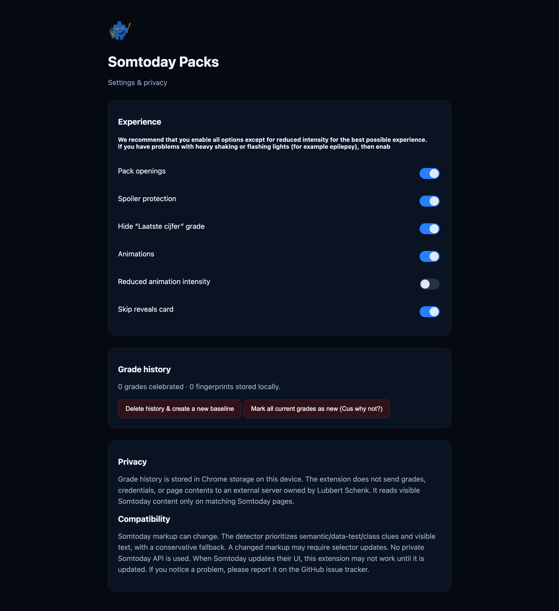

# HTML FILE
There is an HTML version of this Install, this can be found at [LubbertSchenk.nl](https://lubbertschenk.nl/Github/Somtoday/Install.html)

# How to install the extension?
Well, this is an great question. Since we don't have it published on the chrome webstore, you need to manually upload it following the steps noted under here.

### Notes.
Please put the downloaded folder you got from the Github Repository in your Document folder of Windows/MacOS/Linux. You can't delete the folder because it is needed to load the Grade Packs and update your saved grades (which are saved locally inside the folder).

### 1. Chrome Extensions.
The first step is to go to `chrome://extensions` in your Chrome browser. This can be achieved by typing it in the top search bar.
An alternative way to go there is by clicking the three dots in the top right corner, then Extensions and then Manage extensions.

### 2. Developer Mode.
The second step is to enable developer mode, you can do this by clicking the slider in the top right corner where 'Developer mode' is gray. By clicking this you wil see three more buttons appear in the top left corner, this should happen.
  

### 3. Uploading the extensions.
The third step is to upload the folder (which you unzipped and put somewhere safe like the Documents folder). This can be done by pressing the `Load unpacked` button in the top left corner. Then a file window will open (like in the image under here), there you will need to select the folder named `Somtoday-Packs`.
#### Please note that your file explorer may look different because this image was taken on MacOS. This does not change any compatibility.

  After you have uploaded the extensiom, you will see that the extension will be visible right next to any other installed extensions, and in the top right corner you will see the extension logo.
  

### 4. Testing
Now you can go to https://leerling.somtoday.nl and log in to your credentials, and after that you can go to the grades page (`/cijfers`) and there you will see that you can open new packs, if this is not the case, then don't worry. This happends sometimes because the extension loads all already registered grades to the save file, this is completely normal. If you do want to test if it is working, then go to the Somtoday Packs extension and press the small logo next to the extensions button (which can be found next to the three dots in the top right corner).
  
 Then there you can click the `Reset grade history` button and then you will see that you have new packs to open. If that does not work than you can try via the Settings page by clicking the `Open settings` button in the same pop-up.
  
 Here you can press the `Mark all current grades as new (Cus why not?)` button to reset all data stored and then you can open the packs (again).
  

## Further Questions?
We hope that this has helped you to upload the extension and to have tested it. If you have any further questions then contact us via the Issues tab on the Github Repository and use the right Label.