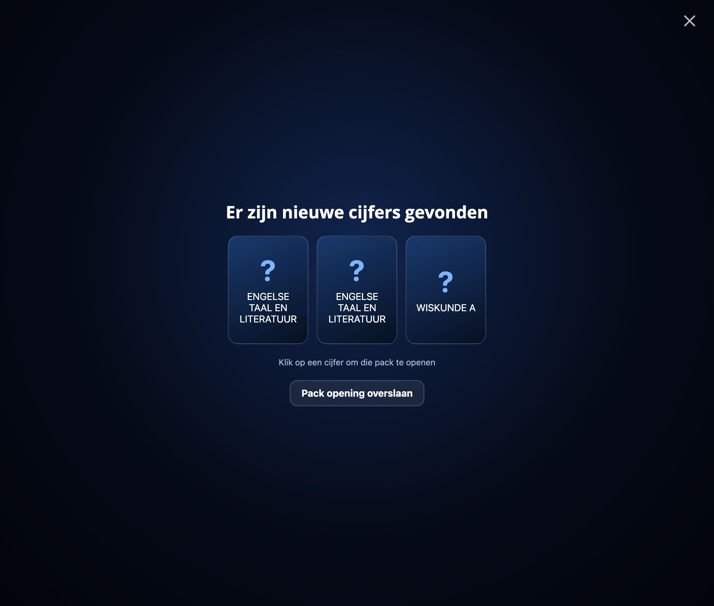
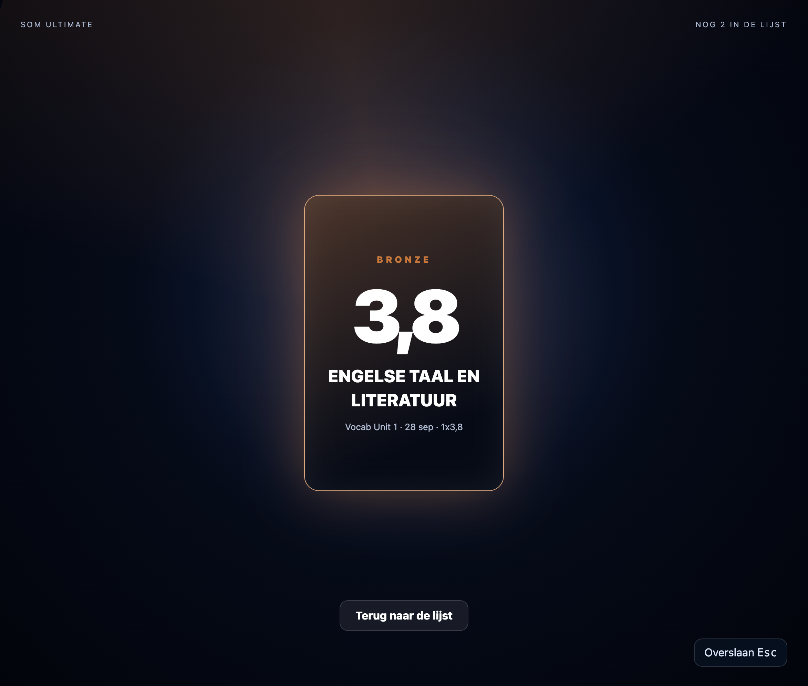

# Somtoday Packs
Version: 1.0

Chrome Extension (Manifest V3) that opens grades like they are EA FC Packs.

## Beta Versions
All BETA versions can be found at our [Github page](https://github.com/LubbertSchenk/Somtoday-Packs).

## Installing
BETA Versions: `chrome://extensions` > Developer Mode > Load Unpacked > Choose this folder.

RELEASE Versions: Installing can be used via the Chrome Webstore.

## First Run
All grades currently present may need to be openend, because the extension scans if there are any new grades, these can be skipped with the appropiate button in the left corner.
Further, if you want to test (and remove all current grades), go to the menu and click "Mark all current grades as new (test)".

## Issues
If you have any issues, you can report them using our issue tracker at the [Github Repository](https://github.com/LubbertSchenk/Somtoday-Packs/issues).

## Notice
We are not affiliated with Somtoday, EA Sports or any partners. This project was started because a friend of mine wanted the Magister Pack Opening to come to Somtoday.

## License
This product is licensed under the MIT license, all information is found in `/LICENSE`.

## Showcasing

### Packs
First we have the Packs. This is shown whwen opening `leerling.somtoday.nl/cijfers`. This shows all new grades that the extension has not yet opened.
  

### Unpacking
Then we have the pack opening. That is what will be showed when you have opened a pack. Please note that the color may be different if your grade is lower or higher.
  

### Popup
Then we have the extension popup page, here are some quick settings showed and quick buttons.
  

### Settings
Then at last we have the Settings page, here are more options and stats displayed that are not in the popup page.
  